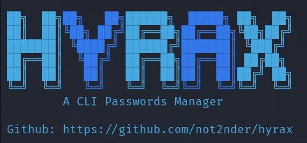

## HYRAX - CLI Password Manager



### How to install:
Clone the repo
```
git clone https://github.com/not2nder/hyrax
```
Install the dependencies
```
cd hyrax
pip install -r requirements.txt
```
Now, you can run the file `main.py`

### How to use? 

**First, you will have to register a new user**

```
python3 main.py --register
```
or 
```
python3 main.py --register -u username
```
**To add a new password, you will need to run this command:**
```
python3 main.py -u user -p password --new -s service -l login
```
**To show your stored passwords, run this command: **

```
python3 main.py -u user -p password --show
```

And your output will be like this
```
+------------+-----------+----------+-----------+
| Password   | Service   | User     |   Pass_id |
+============+===========+==========+===========+
| password   | service   | login    |         1 |
+------------+-----------+----------+-----------+
```

You can use `--color` argument to display the texts with color (blue)

```
python3 main.py -u user -p password --show --color
```

**To delete a password, run this comand:**

```
python3 main.py -u user -p password --delete
```
You can also pass the `pid` of the password in the command

```
--delete --pid 1
```

### Table of commands

| Comand     | Use                             | Alternative |
|------------|---------------------------------|-------------|
| --user     | registered user                 |      -u     |
| --password | user's password                 |      -p     |
| --register | Register a new user             |             |
| --new      | Create and store a new password |             |
| --show     | Show passwords table            |             |
| --service  | (New) service for new pass      |      -s     |
| --login    | (New) login for new pass        |      -l     |
| --delete   | Delete an existing password     |             |
| --pid      | (Delete) id of deleted password |             |
